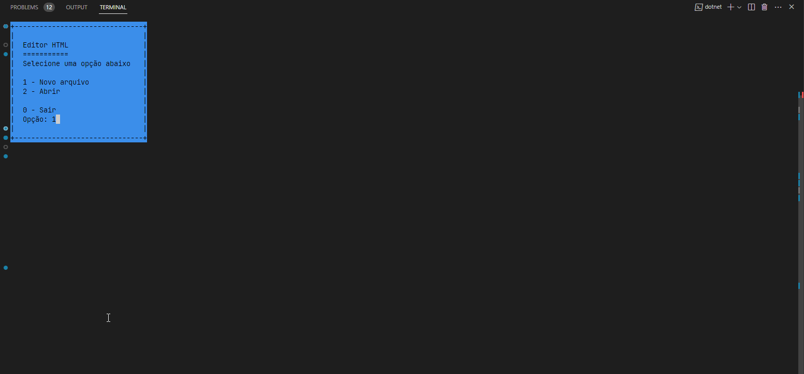
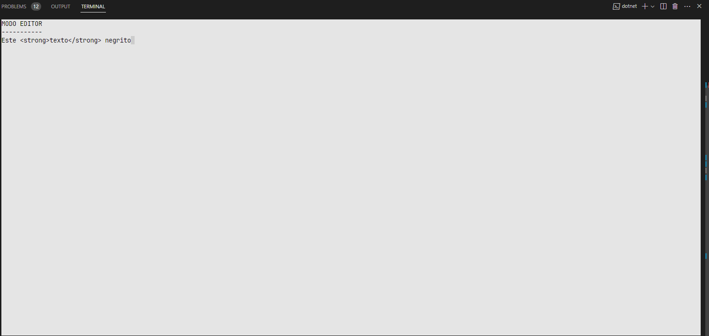
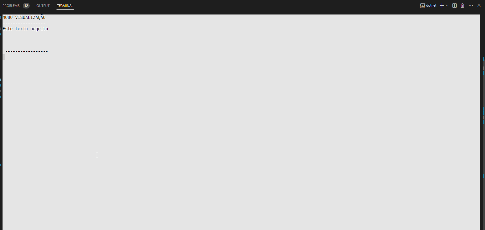

# C# fundamentals

- Stopwatch
- Calculator
- TextEditor
- <details>
  <summary><strong> EditorHtml</strong></summary><br />

    | [](./imgs/editor-html-menu.png "Editor HTML menu") |
    |--|
    | **Figura** **1.1** Screenshot do Editor HTML menu |

    | [](./imgs/editor-html-editor.png "Editor HTML editor") |
    |--|
    | **Figura** **1.2** Screenshot do Editor HTML editor |

    | [](./imgs/editor-html-viewer.png "Editor HTML viewer") |
    |--|
    | **Figura** **1.3** Screenshot do Editor HTML visualizador |
  </details>

## Run

To run use these commands in the terminal:

```bash
# download
git clone https://github.com/Dogl4/csharp-fundamentals.git

# selected project
cd /Caculator/
# or
cd /StopWatch/
# or
cd /TextEditor/
#or
cd /EditorHtml/

# install dependencies
dotnet restore

# run application
dotnet run
```
